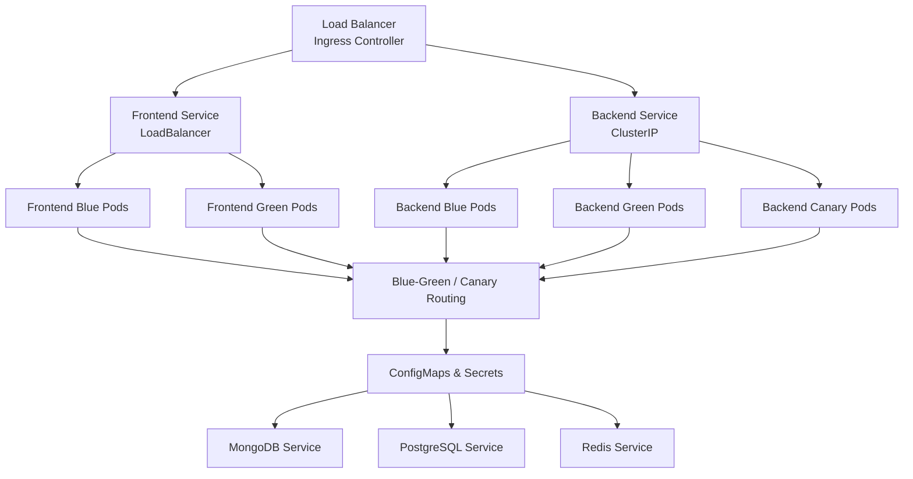

# Kubernetes Deployment Overview

## Architecture Diagram



## Component Overview

### 1. Deployments

#### Blue-Green Deployments
- **Purpose**: Zero-downtime deployments with instant rollback
- **Components**:
  - `backend-deployment-blue.yaml`: Blue version of backend
  - `backend-deployment-green.yaml`: Green version of backend
  - `frontend-deployment-blue.yaml`: Blue version of frontend
  - `frontend-deployment-green.yaml`: Green version of frontend

- **Key Features**:
  - 3 replicas per version
  - Resource limits and requests configured
  - Health probes (liveness, readiness, startup)
  - Security context (non-root, dropped capabilities)
  - Pod anti-affinity for high availability

#### Canary Deployments
- **Purpose**: Gradual rollout with risk mitigation
- **Components**:
  - `backend-deployment-stable.yaml`: Stable production version (9 replicas)
  - `backend-deployment-canary.yaml`: New canary version (1 replica)
  - `frontend-deployment-stable.yaml`: Stable frontend (9 replicas)
  - `frontend-deployment-canary.yaml`: Canary frontend (1 replica)

- **Traffic Split**: Controlled by replica count (10% canary, 90% stable)

### 2. Services

#### Blue-Green Services
```yaml
backend-service-blue-green.yaml:
  - backend-service: Main service (switches between blue/green)
  - backend-service-blue: Direct access to blue version
  - backend-service-green: Direct access to green version
```

#### Canary Services
```yaml
backend-service-canary.yaml:
  - backend-service-canary: Routes to both stable and canary
```

### 3. Horizontal Pod Autoscaler (HPA)

- **File**: `hpa.yaml`
- **Configuration**:
  - Target CPU: 70%
  - Target Memory: 80%
  - Min replicas: 3 (blue-green), 5 (canary stable)
  - Max replicas: 10 (blue-green), 20 (canary stable)

- **Behavior**:
  - Scale up: Fast (100% increase or 4 pods per 15s)
  - Scale down: Slow (50% decrease or 2 pods per 15s, 5min stabilization)

### 4. Pod Disruption Budget (PDB)

- **File**: `pdb.yaml`
- **Configuration**: Minimum 2 pods available during disruptions
- **Purpose**: Maintain availability during:
  - Node maintenance
  - Cluster upgrades
  - Voluntary evictions

### 5. Network Policies

- **File**: `network-policy.yaml`
- **Rules**:
  - Frontend → Backend only
  - Backend → Databases, message queues, caches
  - All pods → DNS
  - Egress restricted to necessary services

### 6. Ingress

- **File**: `ingress.yaml`
- **Features**:
  - SSL/TLS termination
  - Rate limiting (100 req/sec, 10 RPS)
  - Request size limits (10MB)
  - Timeout configuration (60s)
  - Multiple host routing:
    - `api.budgetmanagement.com` → Backend
    - `app.budgetmanagement.com` → Frontend

### 7. ServiceMonitor (Prometheus)

- **File**: `servicemonitor.yaml`
- **Configuration**:
  - Scrape interval: 30s
  - Metrics path: `/metrics`
  - Automatic discovery via labels

## Resource Requirements

### Backend Pods

| Resource | Request | Limit |
|----------|---------|-------|
| CPU | 250m | 500m |
| Memory | 256Mi | 512Mi |

### Frontend Pods

| Resource | Request | Limit |
|----------|---------|-------|
| CPU | 100m | 200m |
| Memory | 128Mi | 256Mi |

### Total Cluster Requirements (Blue-Green)

Assuming both blue and green are running during deployment:

| Component | Pods | CPU Request | Memory Request |
|-----------|------|-------------|----------------|
| Backend Blue | 3 | 750m | 768Mi |
| Backend Green | 3 | 750m | 768Mi |
| Frontend Blue | 3 | 300m | 384Mi |
| Frontend Green | 3 | 300m | 384Mi |
| **Total** | **12** | **2100m (2.1 cores)** | **2304Mi (2.25GB)** |

### Total Cluster Requirements (Canary)

| Component | Pods | CPU Request | Memory Request |
|-----------|------|-------------|----------------|
| Backend Stable | 9 | 2250m | 2304Mi |
| Backend Canary | 1 | 250m | 256Mi |
| Frontend Stable | 9 | 900m | 1152Mi |
| Frontend Canary | 1 | 100m | 128Mi |
| **Total** | **20** | **3500m (3.5 cores)** | **3840Mi (3.75GB)** |

## Deployment Files

```mermaid
flowchart TD
    K[kubernetes]

    subgraph BlueGreen["Blue-Green Deployments"]
        K --> BDB[backend-deployment-blue.yaml<br/>Backend blue version]
        K --> BDG[backend-deployment-green.yaml<br/>Backend green version]
        K --> FDB[frontend-deployment-blue.yaml<br/>Frontend blue version]
        K --> FDG[frontend-deployment-green.yaml<br/>Frontend green version]
    end

    subgraph Canary["Canary Deployments"]
        K --> BDC[backend-deployment-canary.yaml<br/>Backend canary version]
        K --> BDS[backend-deployment-canary-stable.yaml<br/>Backend stable version]
        K --> FDC[frontend-deployment-canary.yaml<br/>Frontend canary version]
        K --> FDS[frontend-deployment-canary-stable.yaml<br/>Frontend stable version]
    end

    subgraph Services["Services"]
        K --> BSBG[backend-service-blue-green.yaml<br/>Blue-green backend services]
        K --> BSC[backend-service-canary.yaml<br/>Canary backend service]
        K --> BSOrig[backend-service.yaml<br/>Original backend service - deprecated]
        K --> FSBG[frontend-service-blue-green.yaml<br/>Blue-green frontend services]
        K --> FSC[frontend-service-canary.yaml<br/>Canary frontend service]
        K --> FSOrig[frontend-service.yaml<br/>Original frontend service - deprecated]
    end

    subgraph Platform["Shared Platform Resources"]
        K --> CFG[configmap.yaml<br/>Application configuration]
        K --> HPA[hpa.yaml<br/>Horizontal Pod Autoscalers]
        K --> PDB[pdb.yaml<br/>Pod Disruption Budgets]
        K --> NP[network-policy.yaml<br/>Network security policies]
        K --> ING[ingress.yaml<br/>Ingress configuration]
        K --> SM[servicemonitor.yaml<br/>Prometheus monitoring]
    end
```



## Quick Start

### 1. Blue-Green Deployment

```bash
# Deploy blue version
kubectl apply -f kubernetes/backend-deployment-blue.yaml
kubectl apply -f kubernetes/frontend-deployment-blue.yaml
kubectl apply -f kubernetes/backend-service-blue-green.yaml
kubectl apply -f kubernetes/frontend-service-blue-green.yaml

# Apply supporting resources
kubectl apply -f kubernetes/configmap.yaml
kubectl apply -f kubernetes/hpa.yaml
kubectl apply -f kubernetes/pdb.yaml
kubectl apply -f kubernetes/network-policy.yaml

# Verify deployment
kubectl get deployments -n production
kubectl get pods -n production
kubectl get services -n production
```

### 2. Canary Deployment

```bash
# Deploy stable and canary versions
kubectl apply -f kubernetes/backend-deployment-canary-stable.yaml
kubectl apply -f kubernetes/backend-deployment-canary.yaml
kubectl apply -f kubernetes/frontend-deployment-canary-stable.yaml
kubectl apply -f kubernetes/frontend-deployment-canary.yaml
kubectl apply -f kubernetes/backend-service-canary.yaml
kubectl apply -f kubernetes/frontend-service-canary.yaml

# Apply supporting resources
kubectl apply -f kubernetes/configmap.yaml
kubectl apply -f kubernetes/hpa.yaml
kubectl apply -f kubernetes/pdb.yaml
kubectl apply -f kubernetes/network-policy.yaml

# Verify deployment
kubectl get deployments -n production
kubectl get pods -n production
kubectl get services -n production
```

## Health Check Endpoints

### Backend

- **Liveness**: `GET /health`
  - Returns 200 if application is alive
  - Failure triggers pod restart

- **Readiness**: `GET /ready`
  - Returns 200 if application is ready to serve traffic
  - Failure removes pod from service endpoints

### Frontend

- **Liveness/Readiness**: `GET /`
  - Returns 200 if application is serving correctly

## Monitoring

### Metrics

Applications expose Prometheus metrics at:
- Backend: `http://backend-service:3000/metrics`
- Frontend: `http://frontend-service:3001/metrics`

### Key Metrics to Monitor

1. **Application Metrics**
   - Request rate
   - Error rate
   - Response time (p50, p95, p99)
   - Active connections

2. **Pod Metrics**
   - CPU usage
   - Memory usage
   - Network I/O
   - Disk I/O

3. **Deployment Metrics**
   - Available replicas
   - Ready replicas
   - Deployment status
   - Rollout progress

## Security Features

### Pod Security

- Non-root user (UID 1000)
- Read-only root filesystem (where applicable)
- Dropped all capabilities
- No privilege escalation
- Seccomp profile applied

### Network Security

- Network policies restrict traffic
- Egress limited to necessary services
- Ingress only from allowed sources
- TLS for external traffic

### Secrets Management

- Kubernetes Secrets for sensitive data
- Environment variables from ConfigMaps
- Secrets mounted as volumes (not environment variables)
- Regular secret rotation recommended

## High Availability

### Features

1. **Multiple Replicas**: Minimum 3 replicas per deployment
2. **Pod Anti-Affinity**: Spread pods across nodes
3. **Pod Disruption Budget**: Maintain minimum availability
4. **Health Checks**: Automatic pod restart and removal
5. **Auto-scaling**: HPA based on CPU/Memory
6. **Rolling Updates**: Zero-downtime deployments

### Node Requirements

For production:
- Minimum 3 nodes
- Recommended 5+ nodes for better distribution
- Node labels for workload separation (optional)

## Troubleshooting

### View Pod Status

```bash
kubectl get pods -n production -l app=backend
kubectl describe pod <pod-name> -n production
kubectl logs <pod-name> -n production
```

### Check Service Endpoints

```bash
kubectl get endpoints backend-service -n production
kubectl describe service backend-service -n production
```

### View HPA Status

```bash
kubectl get hpa -n production
kubectl describe hpa backend-hpa-blue -n production
```

### Check Network Policies

```bash
kubectl get networkpolicies -n production
kubectl describe networkpolicy backend-network-policy -n production
```

## Maintenance

### Regular Tasks

1. **Review and update resource limits** (monthly)
2. **Check HPA scaling patterns** (weekly)
3. **Review pod disruption budgets** (monthly)
4. **Update security policies** (quarterly)
5. **Rotate secrets** (quarterly)
6. **Review and optimize autoscaling** (monthly)
7. **Audit network policies** (quarterly)

### Upgrade Procedures

1. Test in staging environment first
2. Use appropriate deployment strategy
3. Monitor metrics during upgrade
4. Validate functionality post-upgrade
5. Keep previous version available for rollback
6. Document any issues or changes

## Best Practices

1. Always use resource limits and requests
2. Implement comprehensive health checks
3. Use meaningful labels and annotations
4. Enable autoscaling for production workloads
5. Implement network policies for security
6. Monitor all deployments and services
7. Maintain pod disruption budgets
8. Regular backup and disaster recovery testing
9. Document all configuration changes
10. Follow least privilege principle

---

For detailed deployment procedures, see [DEPLOYMENT_GUIDE.md](./DEPLOYMENT_GUIDE.md)
